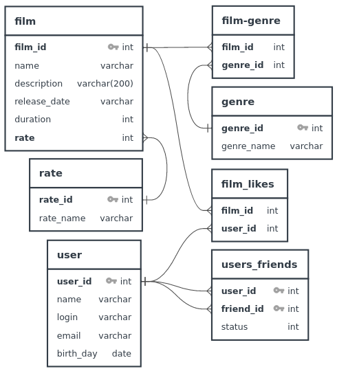

## Решение финального задания спринта 11. ##

### ER – диаграмма для проекта Filmorate ###

#### Примечание. #####
Поле __status__ таблицы __user_friend__ может принимать два значения:
* 0 - пользователь user_id направил заявку стать друзьями пользователю friend_id;
* 1 - пользователь friend_id подвердил заявку в друзья.

### Получение списка всех фильмов (эндпоинт возвращает List < Film >) ###
__WITH__ result_film_Id_genre __AS__  
(__SELECT__ fg.film_id,  
__STRING_AGG__ (result_genre.id_concat_name, ',') __AS__ genre_id_name  
__FROM__ films_genres __AS__ fg  
__LEFT JOIN__ (__SELECT__ genre_id, (genre_id || ':' || genre_name) __AS__ id_concat_name  
__FROM__ genres __AS__ g) __AS__ result_genre  
__ON__ fg.genre_id = result_genre.genre_id  
__GROUP BY__ fg.film_id)
__SELECT__ f.film_id,  
f.film_name,  
f.description,  
f.duration,  
f.rating,  
f.release_date,  
f.rating,  
r.rating_name,  
result_film_Id_genre.genre_id_name  
__FROM__ films __AS__ f  
__LEFT JOIN__ ratings __AS__ r  
__ON__ f.rating = r.rating_id  
__LEFT JOIN__ result_film_Id_genre  
__ON__ f.film_id = result_film_Id_genre.film_id  
__ORDER BY__ f.film_id;  

### Получение фильма по id ###
__WITH__ result_film_Id_genre __AS__  
(__SELECT__ fg.film_id,  
__STRING_AGG__ (result_genre .id_concat_name , ',') __AS__ genre_id_name  
__FROM__ films_genres __AS__ fg  
__LEFT JOIN__ (__SELECT__ genre_id, (genre_id || ':' || genre_name) __AS__ id_concat_name  
__FROM__ genres __AS__ g) __AS__ result_genre  
__ON__ fg.genre_id = result_genre.genre_id  
__GROUP BY__  fg.film_id)  
__SELECT__ f.film_id,  
f.film_name,  
f.description,  
f.duration,  
f.rating,  
f.release_date,  
f.rating,  
r.rating_name,  
result_film_Id_genre.genre_id_name  
__FROM__ films __AS__ f  
__LEFT JOIN__ ratings __AS__ r  
__ON__ f.rating = r.rating_id  
__LEFT JOIN__ result_film_Id_genre  
__ON__ f.film_id = result_film_Id_genre.film_id  
__WHERE__ f.film_id = ?;  

### Получение списка длинной count, сожержащего наиболее популярные фильмы по количеству лайков (эндпоинт возвращает List< Film >) ###
__SELECT__ film_full_info.film_id,  
film_full_info.film_name,  
film_full_info.description,  
film_full_info.duration,  
film_full_info.rating,  
film_full_info.rating_name,  
film_full_info.release_date,  
film_full_info.genre_id_name,  
__COUNT__ (fl.user_id)  
__FROM__ films_likes __AS__ fl __RIGHT JOIN__  
(__WITH__  result_film_Id_genre __AS__  
(__SELECT__ fg.film_id,  
__STRING_AGG__ (result_genre.id_concat_name, ',') __AS__ genre_id_name  
__FROM__ films_genres __AS__ fg  
__LEFT JOIN__ (__SELECT__ genre_id, (genre_id || ':' || genre_name) __AS__ id_concat_name  
FROM genres __AS__ g) __AS__ result_genre  
__ON__ fg.genre_id = result_genre.genre_id  
__GROUP BY__  fg.film_id)  
__SELECT__ f.film_id,  
f.film_name,   
f.description,  
f.duration,  
f.release_date,  
f.rating,  
r.rating_name,  
result_film_Id_genre.genre_id_name  
__FROM__ films __AS__ f __LEFT JOIN__ ratings __AS__ r  
__ON__ f.rating=r.rating_id __LEFT JOIN__ result_film_Id_genre  
__ON__ f.film_id = result_film_Id_genre.film_id  
__ORDER BY__ f.film_id) __AS__  film_full_info
__ON__ fl.film_id = film_full_info.film_id  
__GROUP BY__ film_full_info.film_id,  
film_full_info.film_name,  
film_full_info.description,  
film_full_info.duration,  
film_full_info.rating,  
film_full_info.rating_name,  
film_full_info.release_date,  
film_full_info.genre_id_name  
__ORDER BY__ __COUNT__(fl.user_id) __DESC__,  
film_full_info.film_id  
__LIMIT__ ?;  

### Получение списка всех пользователей (эндпоинт возвращает List< User >) ###
__SELECT__ user_id,  
user_name,  
login, email,  
birth_day  
__FROM__ users  
__ORDER BY__ user_id;  

### Получение пользователя по id ###
__SELECT__ user_id,  
user_name,  
login, email,  
birth_day  
__FROM__ users  
__WHERE__ user_id = ?;  

### Получение списка друзей пользователя по его id (эндпоинт возвращает List< User >) ###
__SELECT__ u.user_id, 
u.user_name,  
u.login,  
u.email,  
u.birth_day  
__FROM__ users_friends __AS__ uf  
__RIGHT JOIN__ users __AS__ u  
__ON__ uf.user_id=u.user_id  
__WHERE__ uf.user_id= ?  
__ORDER BY__ u.user_id;

### Получение списка общих друзей пользователей id1 и id2 (эндпоинт возвращает List< User >) ###
__SELECT__ u.user_id,  
u.user_name,  
u.email,  
u.login,  
u.birth_day  
__FROM__ users_friends __AS__ uf  
__LEFT JOIN__ users __AS__ u __ON__ uf.friend_id = u.user_id  
__WHERE__ uf.user_id =  
__AND__ uf.friend_id __IN__ (__SELECT__ friend_id __FROM__ users_friends __WHERE__ user_id = ?);