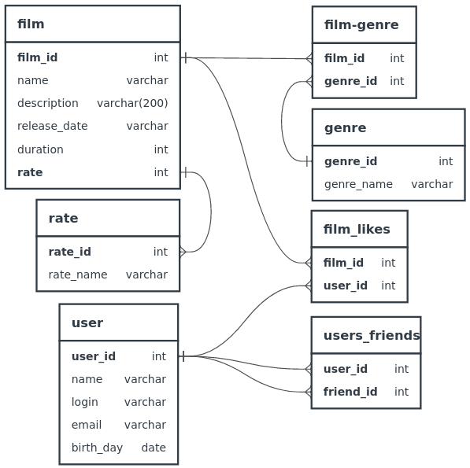

## Решение финального задания спринта 11. ##

### ER – диаграмма для проекта Filmorate ###

#### Примечание. #####
Поле __status__ таблицы __user_friend__ может принимать два значения:
* 0 - пользователь user_id направил заявку стать друзьями пользователю friend_id;
* 1 - пользователь friend_id подвердил заявку в друзья.

### Получение списка всех фильмов (эндпоинт возвращает List < Film >) ###
__SELECT__ f.*,  
__GROUP_CONCAT__(fc.film_category),  
r.rate_name  
__FROM__ film __AS__ f  
__LEFT JOIN__ film_category __AS__ fc  
__ON__ f.film_id=fc.film_id  
__LEFT JOIN__ rate __AS__ r  
__ON__ f.rate=r.rate_id  
__GROUP_BY__ f.film_id  
__ORDER BY__ f.film_id;

### Получение фильма по id ###
__SELECT__ f.*,  
__GROUP_CONCAT__(fc.film_category),  
r.rate_name  
__FROM__ film __AS__ f  
__LEFT JOIN__ film_category __AS__ fc  
__ON__ f.film_id=fc.film_id  
__LEFT JOIN__ rate __AS__ r  
__ON__ f.rate=r.rate_id  
__WHERE__ f.film_id=_id_  
__GROUP_BY__ f.film_id;

### Получение списка длинной count, сожержащего наиболее популярные фильмы по количеству лайков (эндпоинт возвращает List< Film >) ###
__SELECT__ f.*,  
__GROUP_CONCAT__(fc.film_category),  
r.rate_name  
__FROM__ film __AS__ f  
__RIGHT JOIN__ film_likes __AS__ fl  
__ON__ f.film_id=fl.film_id  
__LEFT JOIN__ film_category __AS__ fc  
__ON__ fl.film_id=fc.film_id  
__LEFT JOIN__ rate __AS__ r  
__ON__ f.rate=r.rate_id  
__GROUP BY__  fl.film_id  
__ORDER BY COUNT__(fl.user_id) __DESC__  
__LIMIT__ _count_;

### Получение списка всех пользователей (эндпоинт возвращает List< User >) ###
__SELECT__ *  
__FROM__ user __AS__ u  
__ORDER BY__  u.user_id;  

### Получение пользователя по id ###
__SELECT__ *  
__FROM__ user __AS__ u  
__WHERE__ u.user_id=_id_;  

### Получение списка друзей пользователя по его id (эндпоинт возвращает List< User >) ###
__SELECT__ u.*  
__FROM__ user __AS__ u  
__RIGHT JOIN__ user_friend __AS__ uf  
__ON__ u.user_id=uf.user_id  
__WHERE__ uf.user_id=_id_ __AND__ uf.status=1;

### Получение списка общих друзей пользователей id1 и id2 (эндпоинт возвращает List< User >) ###
__SELECT__ u.*  
__FROM__ user_friend __AS__ uf  
__WHERE__ uf.user_id=_id1_  
__AND__ uf.status=1  
__AND__ uf.friend_id __IN__  
(__SELECT__ uf.friend_id  
__FROM__ uf  
__WHERE__ uf.user_id =_id2_  
__AND__ uf.status=1);